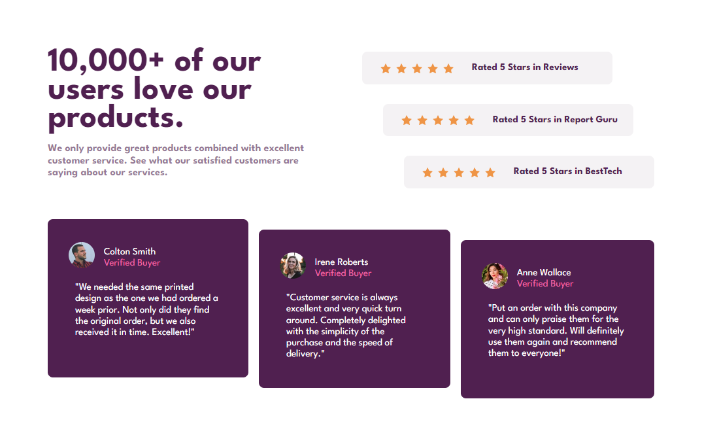
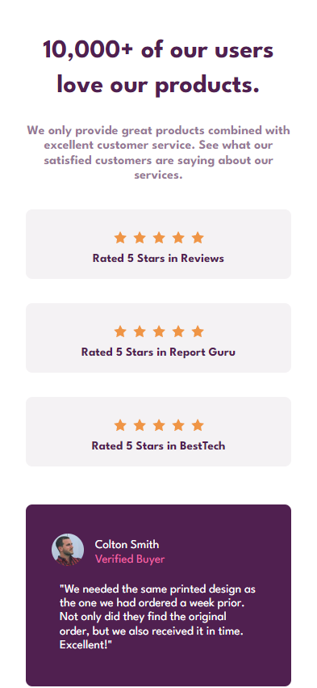
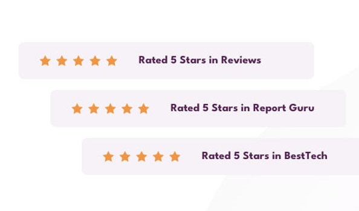

# Frontend Mentor - Social proof section solution

This is a solution to the [Social proof section challenge on Frontend Mentor](https://www.frontendmentor.io/challenges/social-proof-section-6e0qTv_bA). Frontend Mentor challenges help you improve your coding skills by building realistic projects.

[Solution][solution-url] . [Live Page][live-page]

Table of contents

-   [Overview](#overview)
    -   [The challenge](#the-challenge)
    -   [Screenshots](#screenshots)
    -   [Links](#links)
-   [My process](#my-process)
    -   [Built with](#built-with)
    -   [What I learned](#what-i-learned)
    -   [Useful resources](#useful-resources)
-   [Author](#author)

## Overview

### The challenge

Users should be able to:

-   View the optimal layout for the site depending on their device's screen size

### Screenshots

<table>
        <tr>
            <td>
                
            </td>
            <td width="30%">
                
            </td>
            <td>
                
            </td>
        </tr>
</table>

### Links

-   [Solution][solution-url]
-   [Live Page][live-page]

## My process

### Built with

-   Semantic HTML5 markup
-   CSS custom properties
-   Flexbox
-   Desktop-first workflow
-   Responsive design

(<a href="#top">back to top</a>)

### What I learned

The main challenge that was presented to me was to make the "stars section" because I didn't want to use img in the html (there would be 15 img). The first idea was to use background-image, but I had the problem that the stars were too close together, researching I came up with the idea of editing the svg of the star so that it had a space that simulated the margin and created that space between stars .

 
 
 
 

### Useful resources

-   [CSS, background-repeat distance - Stackoverflow](https://stackoverflow.com/questions/16875466/css-background-repeat-distance) - This gave me the idea to edit the svg so that it had a space on the sides, looking a bit like the margins I was looking for.

(<a href="#top">back to top</a>)

## Author

-   Instagram - [@cosmo_art0](https://www.instagram.com/cosmo_art0/)
-   Frontend Mentor - [@CosmoArt](https://www.frontendmentor.io/profile/cosmoart)
-   Twitter - [@CosmoArt0](https://twitter.com/cosmoart0)
-   My personal page - [https://cosmoart.github.io](https://cosmoart.github.io)

(<a href="#top">back to top</a>)

[live-page]: https://cosmoart.github.io/Social-proof-section-solution/
[solution-url]: https://www.frontendmentor.io/solutions/social-proof-section-solution-by-cosmo-B3Jy73lUb1
